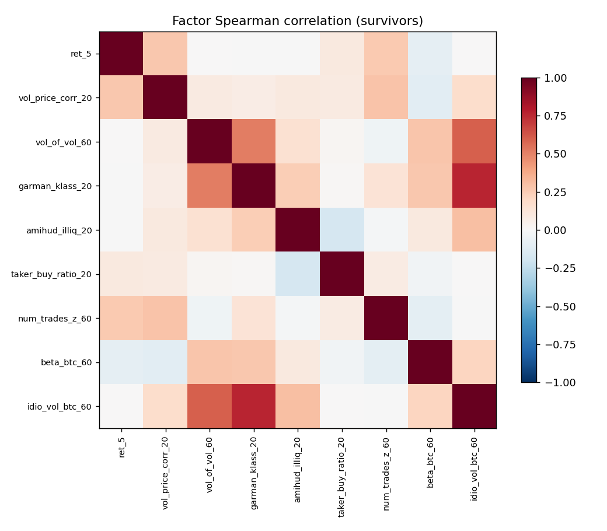
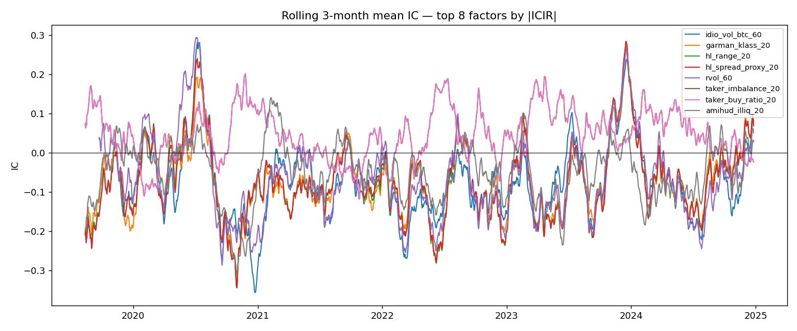

# Phase 1 Factor Report — CRYPTO

- Universe: 16 symbols
- Date range: 2018-01-01 → 2024-12-31
- Forward return horizon: 5 days (log)
- Candidates evaluated: **27**
- Passed IC filter (|ICIR_ann|≥0.5 & sign stability≥0.70): **15**
- Survivors after corr-pruning (|ρ|>0.8): **9**

## All candidates — IC/ICIR

| factor                   |   ic_mean |    icir |   icir_ann |   sign_stability |   t_stat |   hit_rate |   n_obs | passes_ic   | passes_corr   |
|:-------------------------|----------:|--------:|-----------:|-----------------:|---------:|-----------:|--------:|:------------|:--------------|
| idio_vol_btc_60          |   -0.0726 | -0.2034 |     -3.229 |            0.912 |    -8.83 |      0.555 |    1883 | True        | True          |
| garman_klass_20          |   -0.071  | -0.1882 |     -2.987 |            0.971 |    -8.38 |      0.564 |    1983 | True        | True          |
| hl_range_20              |   -0.0704 | -0.183  |     -2.905 |            0.94  |    -8.15 |      0.559 |    1983 | True        | False         |
| hl_spread_proxy_20       |   -0.0702 | -0.1825 |     -2.897 |            0.942 |    -8.13 |      0.556 |    1983 | True        | False         |
| rvol_60                  |   -0.0628 | -0.1674 |     -2.657 |            0.852 |    -7.38 |      0.547 |    1942 | True        | False         |
| taker_imbalance_20       |    0.0457 |  0.1603 |      2.544 |            0.852 |     7.14 |      0.561 |    1983 | True        | False         |
| taker_buy_ratio_20       |    0.0457 |  0.1603 |      2.544 |            0.852 |     7.14 |      0.561 |    1983 | True        | True          |
| amihud_illiq_20          |   -0.0496 | -0.1575 |     -2.501 |            0.968 |    -7.01 |      0.554 |    1982 | True        | True          |
| vol_of_vol_60            |   -0.0454 | -0.151  |     -2.397 |            0.787 |    -6.62 |      0.566 |    1923 | True        | True          |
| rvol_20                  |   -0.0533 | -0.1456 |     -2.311 |            0.849 |    -6.48 |      0.561 |    1982 | True        | False         |
| vol_price_corr_20        |   -0.0314 | -0.1063 |     -1.687 |            0.767 |    -4.73 |      0.534 |    1982 | True        | True          |
| beta_btc_60              |   -0.0353 | -0.0968 |     -1.537 |            0.715 |    -4.27 |      0.524 |    1942 | True        | True          |
| num_trades_z_60          |   -0.0228 | -0.0763 |     -1.212 |            0.826 |    -3.36 |      0.534 |    1943 | True        | True          |
| ret_5                    |   -0.0195 | -0.0617 |     -0.979 |            0.784 |    -2.76 |      0.518 |    1997 | True        | True          |
| mom_accel                |    0.0184 |  0.056  |      0.89  |            0.68  |     2.47 |      0.525 |    1942 | False       | False         |
| dollar_vol_z_60          |   -0.0139 | -0.0461 |     -0.732 |            0.73  |    -2.03 |      0.517 |    1943 | True        | False         |
| ret_10                   |   -0.0142 | -0.0447 |     -0.709 |            0.661 |    -1.99 |      0.512 |    1992 | False       | False         |
| rs_vs_btc_60             |   -0.0133 | -0.0391 |     -0.62  |            0.608 |    -1.72 |      0.524 |    1942 | False       | False         |
| ret_60                   |   -0.0133 | -0.0391 |     -0.62  |            0.608 |    -1.72 |      0.524 |    1942 | False       | False         |
| bb_pos_20                |    0.0096 |  0.0317 |      0.504 |            0.503 |     1.41 |      0.504 |    1983 | False       | False         |
| ret_20                   |    0.0075 |  0.0226 |      0.359 |            0.44  |     1.01 |      0.515 |    1982 | False       | False         |
| obv_slope_20             |    0.0061 |  0.0217 |      0.345 |            0.565 |     0.97 |      0.524 |    1982 | False       | False         |
| dist_ma_20               |    0.0047 |  0.0147 |      0.233 |            0.474 |     0.65 |      0.499 |    1983 | False       | False         |
| vol_ratio_20             |    0.0027 |  0.0093 |      0.147 |            0.522 |     0.41 |      0.501 |    1983 | False       | False         |
| quote_vol_per_trade_z_20 |   -0.0013 | -0.0045 |     -0.071 |            0.446 |    -0.2  |      0.501 |    1983 | False       | False         |
| dist_ma_50               |    0.0008 |  0.0023 |      0.037 |            0.453 |     0.1  |      0.501 |    1953 | False       | False         |
| rsi_14                   |   -0.0007 | -0.0023 |     -0.036 |            0.602 |    -0.1  |      0.497 |    1988 | False       | False         |

## Survivors

| factor             |   ic_mean |   icir_ann |   sign_stability |   t_stat |   n_obs |
|:-------------------|----------:|-----------:|-----------------:|---------:|--------:|
| idio_vol_btc_60    |   -0.0726 |     -3.229 |            0.912 |    -8.83 |    1883 |
| garman_klass_20    |   -0.071  |     -2.987 |            0.971 |    -8.38 |    1983 |
| taker_buy_ratio_20 |    0.0457 |      2.544 |            0.852 |     7.14 |    1983 |
| amihud_illiq_20    |   -0.0496 |     -2.501 |            0.968 |    -7.01 |    1982 |
| vol_of_vol_60      |   -0.0454 |     -2.397 |            0.787 |    -6.62 |    1923 |
| vol_price_corr_20  |   -0.0314 |     -1.687 |            0.767 |    -4.73 |    1982 |
| beta_btc_60        |   -0.0353 |     -1.537 |            0.715 |    -4.27 |    1942 |
| num_trades_z_60    |   -0.0228 |     -1.212 |            0.826 |    -3.36 |    1943 |
| ret_5              |   -0.0195 |     -0.979 |            0.784 |    -2.76 |    1997 |

## Plots

