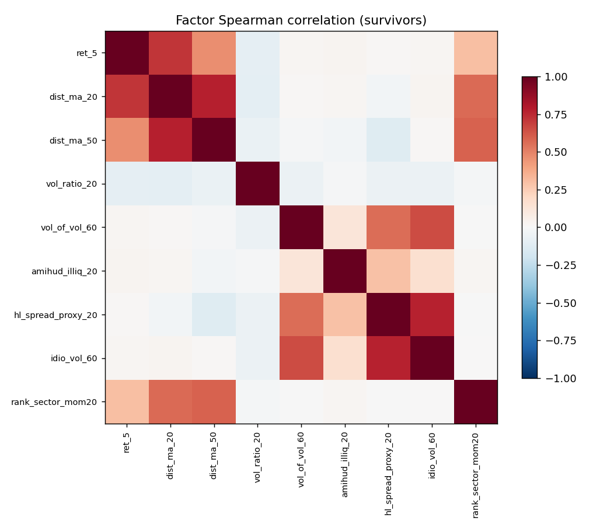
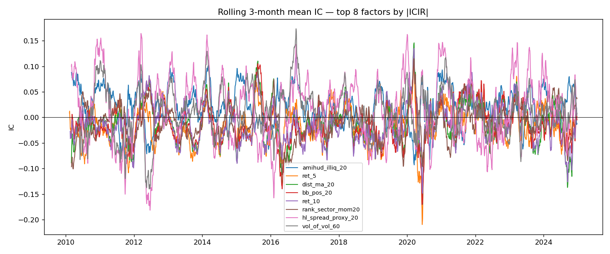

# Phase 1 Factor Report — STOCKS

- Universe: 182 symbols
- Date range: 2010-01-04 → 2024-12-31
- Forward return horizon: 5 days (log)
- Candidates evaluated: **25**
- Passed IC filter (|ICIR_ann|≥0.5 & sign stability≥0.70): **15**
- Survivors after corr-pruning (|ρ|>0.8): **9**

> **Survivorship bias caveat:** the universe uses the *current* S&P 500 top-200 by market cap. Companies that dropped out of the index are not included. This biases results upward versus a true point-in-time universe and should be acknowledged in Phase 5.

## All candidates — IC/ICIR

| factor             |   ic_mean |    icir |   icir_ann |   sign_stability |   t_stat |   hit_rate |   n_obs | passes_ic   | passes_corr   |
|:-------------------|----------:|--------:|-----------:|-----------------:|---------:|-----------:|--------:|:------------|:--------------|
| amihud_illiq_20    |    0.0193 |  0.1291 |      2.049 |            0.895 |     7.9  |      0.552 |    3749 | True        | True          |
| ret_5              |   -0.0147 | -0.0809 |     -1.284 |            0.836 |    -4.96 |      0.529 |    3764 | True        | True          |
| dist_ma_20         |   -0.0127 | -0.0681 |     -1.081 |            0.801 |    -4.17 |      0.511 |    3750 | True        | True          |
| bb_pos_20          |   -0.0107 | -0.0628 |     -0.998 |            0.762 |    -3.85 |      0.512 |    3750 | True        | False         |
| ret_10             |   -0.0115 | -0.0623 |     -0.988 |            0.725 |    -3.82 |      0.514 |    3759 | True        | False         |
| rank_sector_mom20  |   -0.0085 | -0.0622 |     -0.987 |            0.729 |    -3.81 |      0.515 |    3749 | True        | True          |
| hl_spread_proxy_20 |    0.0153 |  0.0606 |      0.962 |            0.744 |     3.71 |      0.532 |    3750 | True        | True          |
| vol_of_vol_60      |    0.0108 |  0.0578 |      0.917 |            0.777 |     3.51 |      0.532 |    3690 | True        | True          |
| garman_klass_20    |    0.0143 |  0.0575 |      0.913 |            0.725 |     3.52 |      0.534 |    3750 | True        | False         |
| idio_vol_60        |    0.0111 |  0.0544 |      0.863 |            0.716 |     3.28 |      0.536 |    3650 | True        | True          |
| rvol_20            |    0.0128 |  0.0524 |      0.832 |            0.719 |     3.21 |      0.534 |    3749 | True        | False         |
| vol_ratio_20       |    0.0052 |  0.0523 |      0.831 |            0.74  |     3.2  |      0.531 |    3750 | True        | True          |
| rs_vs_spy_20       |   -0.0097 | -0.0521 |     -0.826 |            0.73  |    -3.19 |      0.504 |    3749 | True        | False         |
| ret_20             |   -0.0097 | -0.0521 |     -0.826 |            0.73  |    -3.19 |      0.504 |    3749 | True        | False         |
| dist_ma_50         |   -0.0099 | -0.05   |     -0.793 |            0.718 |    -3.05 |      0.499 |    3720 | True        | True          |
| obv_slope_20       |   -0.0067 | -0.0491 |     -0.779 |            0.7   |    -3.01 |      0.509 |    3749 | False       | False         |
| rsi_14             |   -0.0077 | -0.0444 |     -0.704 |            0.687 |    -2.72 |      0.507 |    3755 | False       | False         |
| rvol_60            |    0.0112 |  0.0422 |      0.67  |            0.666 |     2.57 |      0.529 |    3709 | False       | False         |
| mom_accel          |   -0.0065 | -0.0361 |     -0.573 |            0.655 |    -2.2  |      0.513 |    3709 | False       | False         |
| ret_60             |   -0.0065 | -0.032  |     -0.508 |            0.657 |    -1.95 |      0.494 |    3709 | False       | False         |
| rs_vs_spy_60       |   -0.0065 | -0.032  |     -0.508 |            0.657 |    -1.95 |      0.494 |    3709 | False       | False         |
| beta_60            |    0.0092 |  0.0314 |      0.499 |            0.61  |     1.91 |      0.526 |    3709 | False       | False         |
| vol_price_corr_20  |   -0.0029 | -0.0242 |     -0.384 |            0.501 |    -1.48 |      0.507 |    3749 | False       | False         |
| hl_range_20        |    0.0031 |  0.0137 |      0.217 |            0.58  |     0.84 |      0.509 |    3750 | False       | False         |
| dollar_vol_z_60    |    0.001  |  0.0098 |      0.156 |            0.603 |     0.6  |      0.51  |    3710 | False       | False         |

## Survivors

| factor             |   ic_mean |   icir_ann |   sign_stability |   t_stat |   n_obs |
|:-------------------|----------:|-----------:|-----------------:|---------:|--------:|
| amihud_illiq_20    |    0.0193 |      2.049 |            0.895 |     7.9  |    3749 |
| ret_5              |   -0.0147 |     -1.284 |            0.836 |    -4.96 |    3764 |
| dist_ma_20         |   -0.0127 |     -1.081 |            0.801 |    -4.17 |    3750 |
| rank_sector_mom20  |   -0.0085 |     -0.987 |            0.729 |    -3.81 |    3749 |
| hl_spread_proxy_20 |    0.0153 |      0.962 |            0.744 |     3.71 |    3750 |
| vol_of_vol_60      |    0.0108 |      0.917 |            0.777 |     3.51 |    3690 |
| idio_vol_60        |    0.0111 |      0.863 |            0.716 |     3.28 |    3650 |
| vol_ratio_20       |    0.0052 |      0.831 |            0.74  |     3.2  |    3750 |
| dist_ma_50         |   -0.0099 |     -0.793 |            0.718 |    -3.05 |    3720 |

## Plots

